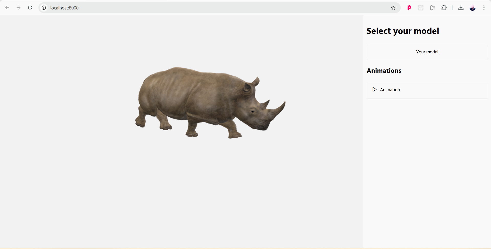
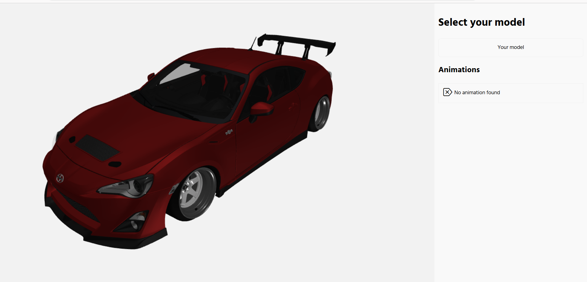

# 3D Viewer Babylon.js

## Demonstration


## Features

- **Display 3D Models**: Support for `.glb` and `.gltf` files
- **Show Animations**: Displays animations of the loaded models

## Technologies

- **Babylon.js**
- **Webpack**
- **Typescript**
- **SASS**

## Project Screenshots

### Hino


### Car



## How to Use

1. **Clone the repository**:
    ```bash
    git clone https://github.com/jordanwmp/3d-viewer-babylonjs
    ```

2. **Install dependencies**:
    ```bash
    npm install
    ```

3. **Build the project**:
    ```bash
    npm run build
    ```

4. **Start the server**:
    ```bash
    npm start
    ```
# Models from Sketchfab

### Hino

    ```bash
        https://sketchfab.com/3d-models/animated-rhinoceros-walking-animal-loop-32abc12d4fe44bd0b116b294194d9615
    ```

### Car

    ```bash
    https://sketchfab.com/3d-models/car-dda372fc79a146a490aeffa026df7ebe
    ```
